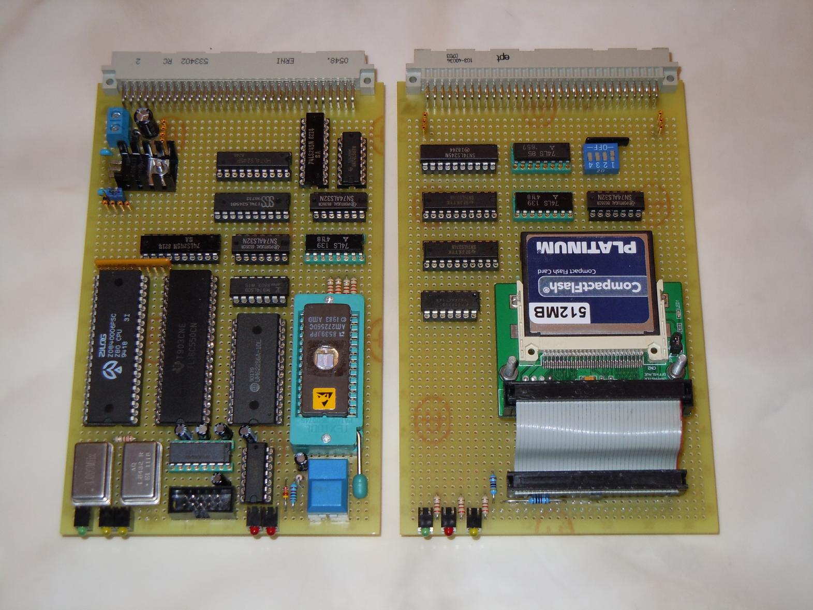

# Z80_monitor
This repository contains the complete sources for a simple Z80 monitor which 
runs with only minor modifications on any decent Z80 system and inlucdes 
Brad Rodriguez' wonderful Camel Forth as well as a port of an ancient Microsoft
NASCOM BASIC interpreter. In addition to this the monitor also supports reading
from FAT16 file systems (only from the root directory as of now).

## History
In September 2011, I built a small Z80 computer remembering my childhood days
when I was socialized with a ZX81, followed by a ZX Spectrum. This particular
system which is described in http://www.vaxman.de/projects/tiny_z80/ consists
currently of a CPU card holding the Z80 CPU itself, 32 kB RAM, 32 kB EPROM,
and a 16550C UART. A second card contains an IDE-controller with a CF-card
adapter:



Hardware alone is not enough and so I began writing a more or less simple
monitor to be able to actually do something (useful) with this Z80 system.
At first this monitor did not much more than just initializing the serial
line and offering some basic functions for dumping and loading memory etc.

In January 2012 my friend Ingo Kloeckl came for a visit and we implemented
a readonly FAT16 file system for the monitor which allowed to load programs
crossassembled/compiled on a host system to be read and started from disk
(a CF card in this particular case).

In early 2012 I found Andrew Lynch's N8VEM Z80 single board computer (see
https://en.wikipedia.org/wiki/N8VEM) and ported my monitor to this system. Since
the N8VEM has different IO-addresses for its controllers and since it relies
on a 8255 parallel IO-chip as its IDE-controller (you need the PPIDE-board to
use this feature), the monitor was quite extensively modified to support both
systems, my own Z80 computer and the N8VEM.

In June 2012 I found Brad Rodriguez' wonderful CAMEL-Forth implementation (see
http://www.camelforth.com) and I decided to embed this into the monitor.

In May 2013 I discovered the source listing of Microsoft BASIC 4.7 (from
1978) which was originally used in the NASCOM system (https://github.com/feilipu/NASCOM_BASIC_4.7).

In June 2013 I found the incredible Z80 disassembler written by John Kerr which
was published in the SUBSET column of "Personal Computer World" 1987. This has
been included into the monitor (https://gist.github.com/jblang/ac99004160d2d96518b2aec2111ec217).


## Basics of the monitor
The monitor is quite versatile and can be adapted to various Z80 systems very
easily since I/O is nicely encapsulated in a few central functions. It resides 
in ROM starting at address 0 but can be assembled to start at any address. 

RST $00 will enter the monitor (do not care about the return address pushed
onto the stack - the stack pointer will be reinitialized during cold as well
as during warm starts.

Monitor routines will generally called by placing the necessary parameters
into some processor registers and then issuing RST $08. More about this later.

Whenever a call to the system routine getc is issued, it is tested if the
character entered was a CTRL-Y (like in VMS :-) ). If so, a restart of the
monitor takes place. Although this interrupt possibility requires a running
program to call getc from time to time it is better than nothing since the
monitor currently does not take care of interrupts at all.

Programs running in memory should not make use of memory above about $FB00 
to leave some space for the monitor stack.

Memory layout is as follows:
```
  +-------+
  ! $FFFF !    General purpose 512 byte buffer
  !  ---  !
  ! $FE00 !
  +-------+
  ! $FDFF !    FAT control block
  !  ---  !
  ! $FDDC !
  +-------+
  ! $FDDB !    File control block
  !  ---  !
  ! $FBBE !
  +-------+
  ! $FBBD !    81 byte string buffer
  !  ---  !
  ! $FB6D !
  +-------+
  ! $FB6C !    12 byte string buffer
  !  ---  !
  ! $FB61 !
  +-------+
  ! $FB60 !    Buffers for various routines
  !  ---  !
  ! $FB4D !
  +-------+
  ! $FB4C !    Scratch area (16 bytes)
  !  ---  !
  ! $FB3D !
  +-------+
  ! $FB3C !    Cold/warm start control (1 byte)
  +-------+
  ! $FB3B !    Stack
  !  ...  !
  ! $8000 !    Begin of RAM
  +-------+
  ! $7FFF !    ROM area
  !  ---  !    RST $08 calls a system routine
  ! $0000 !    RST $00 restarts the monitor
  +-------+
```

At the very beginning of the monitor is an RST-area containing the entry
points for calling system routines. The calling "standard" adopted here
looks like this:

1) Set register IX to the number of the system routine to be called.
2) Set the remaining registers according to the routine's documentation.
3) Execute RST $08 to actually call the system routine.
4) Evaluate the values returned in the registers as described by the 
   Routine's documentation. 
   
(Currently there are no plans to use more RST entry points, so this routine
just runs as long as necessary in memory. If more RSTs will be used, this
routine should to be moved to the end of the used ROM area with only a 
simple jump at the RST $08-location.)

This technique of calling system routines can be used as the following
example program that just echos characters read from the serial line
demonstrates:
```
         org     $8000           ; Start in lower RAM
 loop    ld      ix, 5           ; Prepare call to getc
         rst     08              ; Execute getc
         cp      3               ; CTRL-C pressed?
         jr      z, exit         ; Yes - exit
         ld      ix, 6           ; Prepare call to putc
         rst     08              ; Execute putx
         jr      loop            ; Process next character
 exit    ld      ix, 4           ; Exit - print a CR/LF pair
         rst     08              ; Call CRLF
         ld      hl, msg         ; Pointer to exit message
         ld      ix, 7           ; Prepare calling puts
         rst     08              ; Call puts
         rst     00              ; Restart monitor (warm start)
 msg     defb    "That's all folks.", $d, $a, 0
```
IMPORTANT: The content of ix is destroyed during the call, so it is NOT
         possible to perform successive calls to the same system service
         in a sequence without reloading the ix-register!

Currently the following functions are available (a more detailed description
can be found in the dispatch table itself - search for the label 
dispatch_table):
```
       $00:    cold_start
       $01:    is_hex
       $02:    is_print
       $03:    to_upper
       $04:    crlf
       $05:    getc
       $06:    putc
       $07:    puts
       $08:    strcmp
       $09:    gets
       $0A:    fgetc
       $0B:    dump_fcb
       $0C:    fopen
       $0D:    dirlist
       $0E:    fatmount
       $0F:    fatunmount
       $10:    strchr
       $11:    uart_status
       $12:    getc_nowait
       $13:    print_word
       $14:    print_byte
       $15:    stroup
       $16:    get_word
       $17:    vputc
       $18:    vputs
```

## Building the monitor
The assembler used to build the monitor and its additional components like
Forth and BASIC is zasm which can be found at the following URL.
http://k1.dyndns.org/Develop/projects/zasm/distributions/

The reason for this choice is simple: I needed something which would run on
a UNIX system since I did not want to resort to a CP/M system with TASM or the
like. Some things are handled differently by zasm compared with other Z80
assemblers which required substantial changes in the CAMEL-Forth sources and
some minor changes in the BASIC-interpreter.

### Directory structure
```
monitor:
        camel                       CAMEL-Forth source files
                CAMEL80.S           CAMEL-Forth source
                CAMEL80D.S          CAMEL-Forth source
                CAMEL80H.S          CAMEL-Forth source
                CAMEL_LOADABLE.asm  Source to build a loadable CAMEL-Forth
                CAMEL_ADAPTER.asm   Contains the adapter to the monitor
        clean.bash                  Clean-up script - removes output files
        disassembler                Disassembler sources
                dis_z80.asm         Source of the disassembler
                dis_z80_loadable.asm    Used to build a loadable disassembler
        examples                    Example assembler programs
                mandel.asm          Compute a Mandelbrot set
        hb_z80.asm                  Source to build the monitor for my Z80 sys.
        make.bash                   Calls zasm with the necessary flags
        monitor                     Monitor source
                mondef.asm          Definitions etc. for the monitor and all
                                    programs running under the monitor
                monitor.asm         Source-code of the monitor
        msbasic                     MS-BASIC source files
                basic.asm           The interpreter itself
                basic_loadable.asm  Source to build a loadable BASIC
                examples            Contains example BASIC programs
                        factor.bas  Prime factorization
                        guess.bas   Number guessing game
                        mandel.bas  Mandelbrot set (variant 1)
                        mandel2.bas Mandelbrot set (variant 2)
                        sine.bas    Plots a sine curve
        n8vem.asm                   Source to build the monitor for the N8VEM
```

### Assembling
To build the monitor with Forth and BASIC for my Z80 system just execute

./make.bash hb_z80.asm

This will result in a file hb_z80.rom.hex which is in the Intel hex format
suitable for EPROM programmers and should be stored in a 27256 EPROM (32 kB).

To build the monitor for the N8VEM just assemble the file n8vem.asm instead
of the file mentioned above. The resulting n8vem.rom.hex can then be programmed
into an 27C801 EPROM suitable for the N8VEM SBC.

In case you want a CAMEL-Forth or MS-BASIC which is loadable from IDE-disk
(CF-card), you have to assemble the files CAMEL_LOADABLE.asm and/or
basic_loadable.asm (your working directory should be either camel or msbasic
in this case). Since no EPROM will be burned, assemble these files just with
zasm, not with make.bash. This will result in a file CAMEL_LOADABLE.rom
and/or basic_loadable.rom which can then be copied onto a FAT16 formatted
CF-card.

# Using the monitor
The monitor uses a serial line (9600 baud, 8N1, by default) for communication
with the user. On power-on the monitor prints a welcome message like this:
```
Simple Z80-monitor - V 0.13 (B. Ulmann, Sep. 2011 - May 2013)

Z>
```

All commands are grouped into command-groups which are selected by a single
character. Each such group (except the help-group, selected with H) holds a
set of commands which are selected by a second character. Pressing H will print
the command structure currently implemented.

Usually one wants to mount a CF-card, which is done by entering DM, short for
Disk-group, Mount. To get a file directory listing, enter FD, short for
File-group, Directory. Please note that no ENTER-key has to be pressed - just
the individual keys to select the commands in their respective command-groups.

To start Forth, press SF, short for Subsystem-group, Forth. BASIC is similarly
started with SB.

Both, CAMEL-Forth and BASIC, have been modified to be able to load programs
from the FAT16 formatted CF-card. If Forth is started, a program can be loaded
by entering the word "load" which then prompts the user for a file name.
Loading a program in the BASIC-interpreter works similarly (please note that
the load process does NOT perform an implicit NEW - it works like a merge):
First clear the program memory with "new" and then load the program with
"cload" which in turn prompts for the filename. The filenames are
case-sensitive! If an invalid/non-existent filename is specified, nothing
happens.

